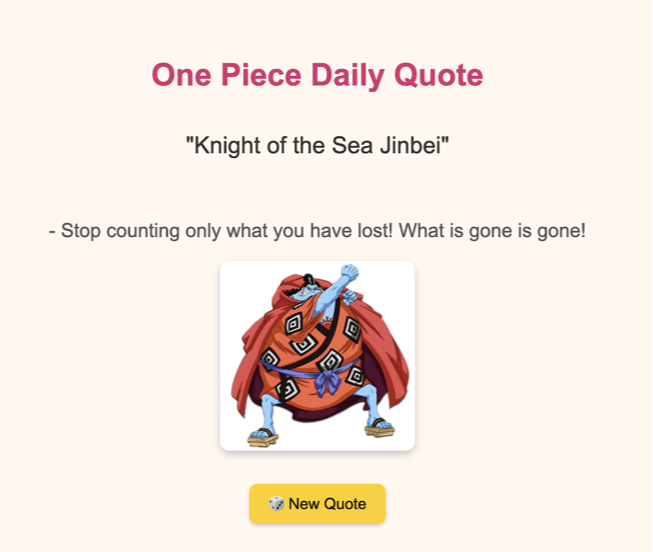

# 🏴‍☠️ Kaizoku Quote App

Welcome to the **Kaizoku Quote App**, a mini passion project built to display random inspirational or hilarious quotes from the world of **One Piece** — with character images — and hosted entirely on an **AWS EC2 instance**.

---

## 🌟 What It Does

Every time you visit or click the 🎲 button:

- You get a **random quote** from One Piece  
- The **character’s name** appears  
- A **character image** is shown  
- All served live from your very own EC2 instance!

---

## 🧰 Tech Stack

| Layer         | Tech Used                    |
|--------------|------------------------------|
| Hosting      | AWS EC2 (Amazon Linux 2)     |
| Web Server   | Apache / httpd               |
| Script Logic | Bash script with CGI         |
| Frontend     | HTML + JavaScript            |
| Media        | Static images (JPG/PNG)      |

---

## 📁 Project Structure

---

## 🚀 Deploy on EC2

After setting up your EC2 instance:

1. Install Apache: `sudo yum install -y httpd`
2. Enable CGI: update Apache config to allow `/cgi-bin`
3. Upload all files via SCP or Git
4. Make script executable: `chmod +x get_quote.sh`
5. Access your app: `http://<EC2-IP>/index.html`

> 💡 Bonus: Add a cron job or update quotes regularly for freshness.

---

## 📸 Sample Output

> “Knight of the Sea - Jinbei"
> Stop counting on what you have lost! What is gone, is gone!

---

## 💡 Learning Goals

- Understand EC2 Linux hosting  
- Practice Bash scripting and CGI  
- Serve dynamic content with minimal tech  
- Use Git & GitHub for version control

---

## 🧭 Inspired By

This app is a small tribute to the **One Piece** anime universe — teaching lessons about persistence, dreams, and friendship!

> _“Power isn’t determined by your size, but the size of your heart and dreams!”_

---

## 🛠 Built with ❤️ by [zehra-stark](https://github.com/zehra-stark)

